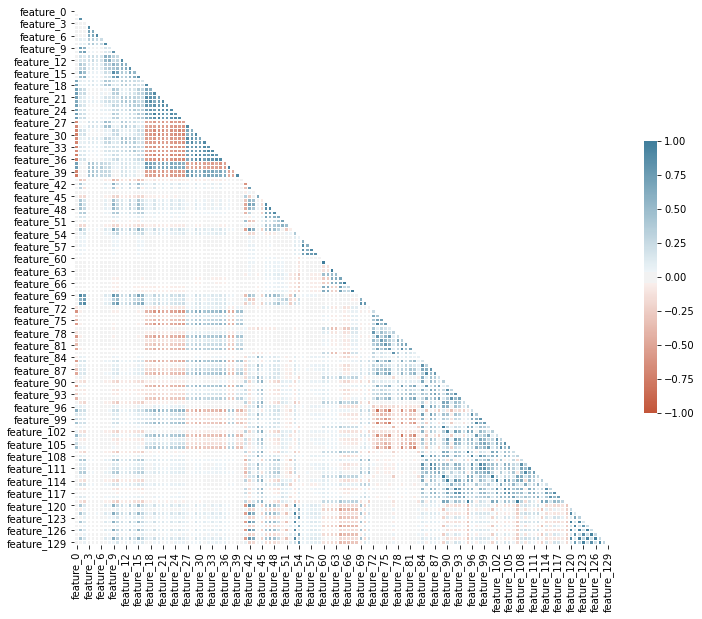
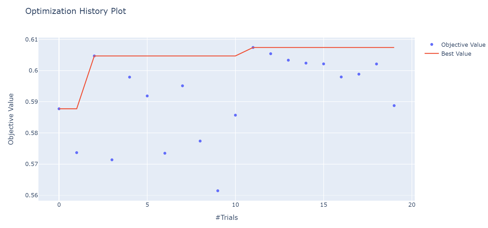
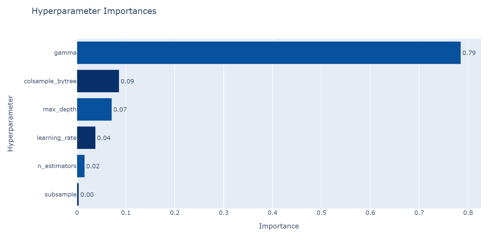

# Quantitative Trading Model to Identify Arbitrage Opportunities using XGBoost
In this Kaggle competition organised by Jane Street, I build a quantitative trading model to maximize returns using market data from a major global stock exchange.

The efficient market hypothesis posits that markets cannot be beaten because asset prices will always reflect the fundamental value of the assets. In a perfectly efficient market, buyers and sellers would have all the agency and information needed to make rational trading decisions. In reality, financial markets are not efficient. The purpose of this trading model is to identify arbitrage opportunities to "buy low and sell high". In other words, we exploit market inefficiencies to identify and decide whether to accept or reject potential trades.

I use XGBoost (extreme gradient boosting) - a hugely popular ML library due to its superior execution speed and model performance - to predict profitable trades. I also use Optuna - an automatic hyperparameter optimization software framework - to tune the hyperparameters of the classification model.

See jane-street-xgboost-classification.ipynb for the Jupyter Notebook.

# Data Sources
The dataset, provided by Jane Street, contains an anonymized set of 129 features and over 2 million potential trades based on actual stock market data. Each row in the dataset represents a trading opportunity, for which I predict an action value: 1 to make the trade and 0 to pass on it. 

# Methods
1) Data Cleaning (e.g. imputation of missing values) and Exploratory Data Analysis
2) Tune XGBClassifier Hyperparameters using Optuna
3) Fit the classifier on the training set and make predictions on test set

*Heatmap to show correlations between the 129 features*

*Optimisation history plot (shows accuracy score against number of trials during hyperparameter tuning process)*

*Plot showing the relative importances of different hyperparameters (generated using Optuna)*

# Results
The tuned trading model has an accuracy of almost 70% on the hold-out validation set.

# Applications and Future Work
Due to the high dimensionality of the dataset, I initially wanted to use Principal Components Analysis (PCA) to identify features to be used for supervised learning. The intuition is to compress the dataset and use it more efficiently. However, I realised that the performance of the model worsens significantly with PCA. I want to explore other methods to strike a balance between having an acceptable runtime and robust predictions.

It would also be interesting to build a program to automate orders (algorithmic trading).
